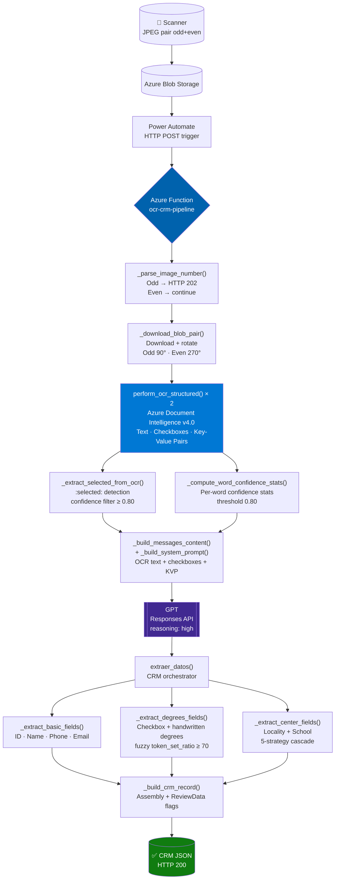
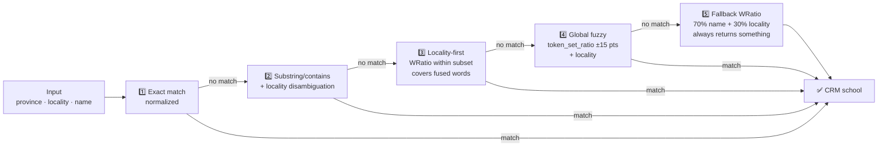
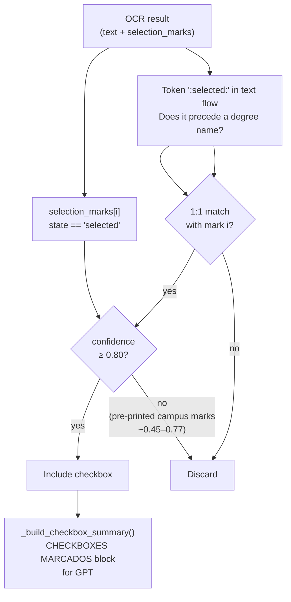

<div align="center">

# ocr-crm-pipeline

**Automated digitization of handwritten academic enrollment forms**

*Azure Function · Structured OCR · Fuzzy matching · GPT*

[](https://www.python.org/)
[](https://azure.microsoft.com/services/functions/)
[](https://azure.microsoft.com/services/form-recognizer/)
[](https://openai.com/)
[](https://github.com/maxbachmann/RapidFuzz)
[](scripts/)

</div>

---

## Architecture walkthrough (video)

This [YouTube walkthrough](https://youtu.be/CRjsfj677tY) explains the main architectural decisions of the pipeline.

[](https://youtu.be/CRjsfj677tY)

---

## Why this exists

A private Spanish university had no automated process for handling paper enrollment forms. Students would fill out handwritten forms on-site, and those forms were then sent to an external company for manual digitization — a slow, costly, and error-prone process that didn't scale with the volume of incoming students each academic year.

I was given the task of designing and building a solution from scratch. My goal was to eliminate the external dependency entirely and replace it with a fully automated pipeline that could take a scanned form and produce a structured CRM record in seconds.

The result is this system: a combination of **Azure Document Intelligence** (structured OCR + checkbox detection), **GPT** (field extraction and reasoning over ambiguous handwriting), and a **custom fuzzy matching engine** (to resolve school names, localities, and academic programs against the CRM catalog). The whole thing runs as a serverless Azure Function triggered by Power Automate whenever the scanner drops a new image into Blob Storage.

This repository is shared publicly as a technical reference and portfolio piece. The catalog data (school IDs, degree IDs, locality IDs) has been **anonymized** — replaced with sequential placeholder UUIDs — so no proprietary CRM data is exposed.

## Fake Example
This video demonstrates the processing of a sample form with the function hosted locally. This process requires the form to have been scanned beforehand using the printer, so that the images can be downloaded from the Azure host. The video shows that scanning a form takes approximately 40–60 seconds. This should not be a cause for concern, as this process can be fully parallelised in batches. Furthermore, it is worth noting that an automated process can run continuously, day and night. Alongside the video, a sample of the fictitious handwritten form is shown.

https://github.com/user-attachments/assets/b708e088-e4d4-4c1e-8a98-a77cd27e07ee


---

## Table of contents

- [Architecture walkthrough (video)](#architecture-walkthrough-video)
- [Pipeline architecture](#pipeline-architecture)
- [Quick start](#quick-start)
- [API Reference](#api-reference)
- [CRM record fields](#crm-record-fields)
- [Matching engine](#matching-engine)
- [Checkbox detection](#checkbox-detection)
- [Data catalogs](#data-catalogs)
- [Tests](#tests)
- [Diagnostics and debugging](#diagnostics-and-debugging)
- [Project structure](#project-structure)
- [Design decisions](#design-decisions)
- [Known limitations](#known-limitations)

---

## Pipeline architecture



**Average processing time**: a full enrollment form (front + back) typically takes **30–40 seconds** end to end in production.

---

## Quick start

### Prerequisites

- Python 3.11
- Azure account with Functions, Blob Storage, and Document Intelligence (Standard tier)
- Azure OpenAI deployment with GPT-4 or later

### Environment variables

Copy `local.settings.example.json` to `local.settings.json` and fill in your credentials:

```json
{
  "IsEncrypted": false,
  "Values": {
    "AzureWebJobsStorage": "UseDevelopmentStorage=true",
    "FUNCTIONS_WORKER_RUNTIME": "python",
    "AZURE_STORAGE_CONNECTION_STRING": "DefaultEndpointsProtocol=...",
    "AZURE_BLOB_CONTAINER": "fichas-si-escaneadas",
    "DOCUMENT_INTELLIGENCE_ENDPOINT": "https://<resource>.cognitiveservices.azure.com/",
    "DOCUMENT_INTELLIGENCE_KEY": "<key>",
    "OPENAI_ENDPOINT": "https://<resource>.openai.azure.com/",
    "OPENAI_API_KEY": "<key>",
    "OPENAI_DEPLOYMENT_NAME": "gpt-4o",
    "OPENAI_API_VERSION": "2025-03-01-preview"
  }
}
```

### Install

```bash
pip install -r requirements.txt
```

### Run locally

```bash
func start
```

---

## API Reference

### `POST /api/procesa_ficha`

**Request**

```json
{
  "nombre_imagen": "scan_fichas_2025-11-28_22.jpeg",
  "prompt": "Extrae todos los datos del formulario"
}
```

> The trailing number (`_22`) identifies the pair. The system always expects both sides: odd (front) and even (back).

**Response `200` — success**

```json
[{
  "Description": "Solicitud de información procedente de escaneo automático",
  "DNI": "12345678A",
  "Firstname": "Juan",
  "Middlename": "García",
  "Lastname": "López Martínez",
  "Mobilephone": "+34612345678",
  "Email": "juan.garcia@gmail.com",
  "IdStudentCurse": "00000000-0000-0000-0000-000000000001",
  "ProvenanceCenterId": "00000000-0000-0000-0000-000000000002",
  "ProvenanceCenterName": "IES EJEMPLO - LOCALIDAD",
  "ProvenanceCenterProvinceId": "00000000-0000-0000-0000-000000000003",
  "ProvenanceCenterCityId": "00000000-0000-0000-0000-000000000004",
  "ProvenanceCenterCountryId": "00000000-0000-0000-0000-000000000005",
  "OtherCenter": "",
  "Degrees": [
    { "IdStudy": "00000000-0000-0000-0000-000000000006" },
    { "IdStudy": "00000000-0000-0000-0000-000000000007" }
  ],
  "ReviewData": false,
  "FieldsToReview": ""
}]
```

`IdStudy` and `Degrees` are dynamic and mutually exclusive. A single resolved degree uses `"IdStudy": "..."`; two or more use `"Degrees": [{"IdStudy": "..."}, ...]`.

**Response codes**

| Code | Situation |
|------|-----------|
| `200` | Success — array with the processed CRM record |
| `202` | Odd image received — waiting for the even (back) side |
| `400` | Validation error — invalid input |
| `500` | Internal error during processing |

---

## CRM record fields

| Field | Source | Function | Notes |
|-------|--------|----------|-------|
| `DNI` | GPT | `_normalize_dni_nie()` | Corrects OCR errors in numeric positions; if the check letter doesn't match mod-23, it's kept as-is and flagged for review. If missing or a digit, it's calculated and flagged. |
| `Firstname` | GPT | `clean_text()` | Cleaned first name |
| `Middlename` | GPT | surname split | First word of `apellidos` |
| `Lastname` | GPT | surname split | Remaining words of `apellidos` |
| `Mobilephone` | GPT | `_normalize_phone()` | Corrects OCR letter substitutions; prepends `+34` if missing |
| `Email` | GPT | `_normalize_email()` | Strips internal spaces; validates structure for review flags |
| `Description` | constant | `_build_crm_record()` | `"Solicitud de información procedente de escaneo automático"` |
| `IdStudentCurse` | GPT | `analyze_curso_local()` | `token_set_ratio` threshold 60 |
| `ProvenanceCenter*` | GPT | `analyze_center_optimized()` | 5-strategy cascade |
| `OtherCenter` | GPT | literal | Only set when no catalog match is found |
| `IdStudy` / `Degrees[].IdStudy` | Checkboxes + GPT | `map_checked_degrees()` | Dynamic field: one degree → `IdStudy`; two or more → `Degrees[]` |
| `ReviewData` | — | `_build_crm_record()` | `true` if any critical field has low OCR confidence |
| `FieldsToReview` | — | `_build_crm_record()` | Comma-separated list of fields to review |

<details>
<summary><code>ReviewData</code> propagation rules</summary>

- **Name and Surname** can propagate flags to each other, unless the KVP for the other field has high confidence (≥90%).
- **Email** does not inherit flags from Name/Surname. It is only flagged with its own evidence: invalid structure, normalized accents, HIGH-confidence word near the email, or institutional/school domain (`school`, `colegio`, `instituto`, `academy`, `.org`, etc.).
- **School** is not flagged for medium OCR confidence alone if the CRM resolved it via exact/contains match. It is flagged if `OtherCenter` is used, or if fuzzy/locality/fallback strategies fall below `CENTER_REVIEW_SCORE_THRESHOLD` (80).
- **DNI and Phone** are flagged individually when their word confidence falls below the threshold.

> Philosophy: a false positive (reviewing something that was correct) is always preferable to a false negative (leaving a wrong value in the CRM undetected).

</details>

---

## Matching engine

### Province resolution

`_find_province_key` applies this pipeline in order:

1. **Exact** — any key loaded dynamically from `centros/{PROVINCE}.txt`
2. **Alias** — explicit entries for the Valencian Community + aliases from `localidades/provinceIds.json`
3. **Prefix** (≥ 3 chars) — `VAL→VALENCIA`, `ALI→ALICANTE`, `MUR→MURCIA`, etc.
4. **Fuzzy** `max(ratio, WRatio)` threshold 60 — always returns something

<details>
<summary>Province alias table</summary>

| Province | Covered aliases |
|----------|-----------------|
| Valencia | `CV`, `C. Valenciana`, `Comunitat Valenciana`, `País Valenciano`, `Prov. de Valencia`, `Val3ncia` |
| Alicante | `Alacant`, `Alacante`, `Aliante`, `Elche`, `Elx`, `Alic4nte` |
| Castellón | `Castelló`, `Castello`, `Castillón`, `Castelion`, `Castellon de la Plana`, `Kostellon`, `Castel1on` |

</details>

### Locality normalization

`_normalize_localidad_input` applies explicit bilingual pairs and OCR abbreviation expansion before fuzzy matching (3 scorers: `ratio` + `token_set_ratio` + `WRatio`, threshold ≥ 80).

<details>
<summary>Locality aliases and OCR abbreviations</summary>

**Bilingual pairs:**
`Játiva → XÀTIVA` · `Burriana → BORRIANA` · `Villarreal → VILA-REAL` · `Alcoy → ALCOI` · `Alcira → ALZIRA` · `Alacant → ALICANTE` · `Castellon → CASTELLÓN DE LA PLANA`

**Frequent OCR abbreviations:**
`STA → SANTA` · `NTRA → NUESTRA` · `COL → COLEGIO` · `INST → INSTITUTO` · `CEIP → COLEGIO`

</details>

### School search — 5-strategy cascade

`analyze_center_optimized` runs strategies in order and stops at the first match:



**Fused-word coverage** (strategy 3, `WRatio` + `partial_ratio`):

| OCR input | Result |
|-----------|--------|
| `Materdei` | `DIOCESANO MATER DEI` |
| `AusiàsMarch` | `AUSIÀS MARCH` |
| `AntonioMachado` | `ANTONIO MACHADO` |
| `BotanicCalduch` | `BOTÀNIC CALDUCH` |

---

## Checkbox detection

`_extract_selected_from_ocr` is the single source of checkbox detection. It combines two signals from Azure Document Intelligence:



> Students may mark with `X` or a tick. The pattern `:selected: X Degree` automatically strips the prefix before extracting the name.

**Province variant selection:**
When a degree exists in multiple campus variants, `_select_best_variant_by_province` picks the one that matches the student's school province, with fallback.

| Student province | Variant applied |
|-----------------|-----------------|
| Alicante | Elche |
| Castellón | Castellón |
| Murcia | Elche |
| Other provinces without a dedicated variant | Valencia |
| Valencia | Valencia |

---

## Data catalogs

| Catalog | File | Notes |
|---------|------|-------|
| Degrees | `titulacion/titulaciones.txt` | ~100 degrees grouped by checkbox |
| Schools | `centros/{PROVINCE}.txt` | 8 active provinces |
| Courses | `curso/cursos.txt` | 5 academic years |
| Localities | `localidades/{PROVINCE}.json` + `provinceIds.json` | localities with CRM IDs per province |

> ⚠️ All IDs in these files are **anonymized placeholders**. They must be replaced with the real CRM IDs for any actual deployment.

<details>
<summary>Catalog file formats</summary>

**`titulacion/titulaciones.txt`**
```
DEGREE NAME, IdDegree
DEGREE NAME (CASTELLÓN), IdDegree
DEGREE NAME (ELCHE), IdDegree

[blank line = checkbox separator]
```

**`centros/PROVINCE.txt`**
```
SCHOOL NAME (LOCALITY), Id, IdProvince, IdCity, IdCountry
```

**`localidades/PROVINCE.json`**
```json
[{ "Id": "...", "Name": "CASTELLÓN DE LA PLANA", "Name_cat": "CASTELLÓ DE LA PLANA" }]
```

To regenerate from the CRM:
```bash
python scripts/fetch_localidades.py       # Requires CRM API credentials
python -m scripts.procesar_centros_raw    # Processes centros/centrosTablasCRM/*.xlsx
```

</details>

---

## Tests

The project uses local test scripts without pytest.

```bash
export PYTHONPATH="/path/to/repo"

# School/province/locality suite — main
python -m scripts.test_centros

# DNI/phone suite — 45 tests
python -m scripts.test_dni_phone

# Review flags suite
python -m scripts.test_review_flags

# DNI/NIE normalization
python -m scripts.test_dni_normalize

# Course matching
python -m scripts.test_course_matching

# OCR misspelling cases
python -m scripts.test_misspell_cases

# Word confidence
python -m scripts.test_word_confidence
```

<details>
<summary>How to add a new test</summary>

**`test_centros.py` pattern**
```python
r = analyze_center_optimized("Valencia", "Godella", "EDELWEISS")
got = r.get("Name", "") if r else ""
passed = "EDELWEISS" in got.upper()
results.append(("name 'EDELWEISS' Godella", passed))
print(f"  {'OK' if passed else 'FAIL'}: {got or '(empty)'}")
```

**`test_dni_phone.py` pattern**
```python
check(results, "OCR: O→0 at position 3",
      _normalize_dni_nie("123O5678A"), "12305678A")
```

To add a full suite: create `run_new_suite_tests() -> bool`, add it to the `if __name__ == "__main__"` block, and include it in `overall = ok1 and ok2 and ... and ok_new`.

</details>

---

## Diagnostics and debugging

The main pipeline emits no application logs and generates no debug snapshots with personal data.
Debugging relies on local tests and controlled reproductions using the OCR text of the failing case.

<details>
<summary>Production error debugging flow</summary>

1. Identify the affected field in `FieldsToReview`.
2. Reproduce locally: run the affected function with the OCR text of the case.
3. **Minimal fix**: alias dict for a known OCR case; new test for a new case; threshold adjustment only as a last resort.
4. Verify with the full test suite before committing.

</details>

---

## Project structure

```
ocr-crm-pipeline/
├── procesa_ficha/
│   ├── __init__.py          # All logic (~3,000 lines, 13 sections)
│   └── function.json        # HTTP trigger binding
│
├── centros/                 # School catalogs by province (anonymized IDs)
│   ├── VALENCIA.txt
│   ├── ALICANTE.txt
│   ├── CASTELLON.txt
│   ├── ALBACETE.txt
│   ├── BALEARES.txt
│   ├── CUENCA.txt
│   ├── MURCIA.txt
│   ├── TERUEL.txt
│   └── centrosPendientesMatching.txt
│
├── titulacion/
│   └── titulaciones.txt     # ~100 degrees (anonymized IDs)
│
├── curso/
│   └── cursos.txt           # 5 academic years (anonymized IDs)
│
├── localidades/
│   ├── VALENCIA.json
│   ├── ALICANTE.json
│   ├── CASTELLON.json
│   ├── ALBACETE.json
│   ├── BALEARES.json
│   ├── CUENCA.json
│   ├── MURCIA.json
│   ├── TERUEL.json
│   └── provinceIds.json
│
├── scripts/
│   ├── test_centros.py
│   ├── test_dni_phone.py
│   ├── test_review_flags.py
│   ├── test_dni_normalize.py
│   ├── test_course_matching.py
│   ├── test_misspell_cases.py
│   ├── test_word_confidence.py
│   ├── fetch_localidades.py
│   └── procesar_centros_raw.py
│
├── docs/
│   └── tecnico/
│       ├── DOCUMENTACION_TECNICA.md
│       └── EXTRACTION_FLOW.md
│
├── host.json                       # Azure Functions v4 config
├── requirements.txt
├── local.settings.example.json     # Env variable template
└── local.settings.json             # Local secrets — NOT committed (see .gitignore)
```

---

## Design decisions

<details>
<summary>Why GPT doesn't receive the images directly</summary>

GPT only receives OCR text + checkbox summary. Azure Document Intelligence already extracts text with high accuracy and its coordinates are more reliable than direct model vision. This reduces cost and latency without meaningful loss of precision.

</details>

<details>
<summary>Why the school fallback always returns something</summary>

An incorrect match that a CRM operator can correct is always better than an empty field that nobody can recover. The `ReviewData` flag signals when confidence is low.

</details>

<details>
<summary>Why no strict JSON Schema for GPT</summary>

`json_object` mode is used instead of a full JSON Schema. This avoids rejections caused by optional empty fields, which are common in handwritten forms where students don't always fill everything in.

</details>

<details>
<summary>Matching and OCR confidence thresholds</summary>

| Parameter | Value | Use |
|-----------|-------|-----|
| `TITULACION_MATCH_THRESHOLD` | 70 | fuzzy degree matching |
| `PROVINCE_MATCH_THRESHOLD` | 60 | fuzzy province matching |
| `COURSE_MATCH_THRESHOLD` | 60 | fuzzy course matching |
| `SELECTION_MARK_CONFIDENCE_THRESHOLD` | 0.80 | checkbox filtering (pre-printed campus marks ~0.45–0.77) |
| `WORD_CONFIDENCE_THRESHOLD` | 0.80 | words sent to GPT as uncertain |
| `WORD_CONFIDENCE_HIGH_CUTOFF` | 0.40 | HIGH tier for strong OCR evidence |
| `CENTER_REVIEW_SCORE_THRESHOLD` | 80 | minimum score to skip review for fuzzy/locality/fallback matches |
| `GPT_MAX_OUTPUT_TOKENS` | 32,000 | GPT response token limit |
| Locality scoring | ≥ 80 | `ratio` + `token_set` + `WRatio` |

> Lowering thresholds increases false positives. Review production telemetry before modifying them.

</details>

---

## Known limitations

- **Two pages only** — the system assumes exactly one front + one back. It does not support 1 or 3+ pages.
- **Limited geographic coverage** — automatic matching only works for provinces with a TXT in `centros/` and a JSON in `localidades/`. An uncatalogued province may produce incorrect school matches.
- **Static catalogs** — if degrees, schools, or localities change in the CRM, regenerate the files and redeploy.
- **No retry queue** — no automatic recovery on OCR or GPT failures.
- **Fixed rotation** — assumes a constant scanner orientation. If it changes, adjust `_download_blob_pair`.
- **No minimum threshold for school fallback** — always returns the best candidate regardless of score; use `ReviewData` to catch low-confidence results.

---

<div align="center">

*Documentation verified against source code (`procesa_ficha/__init__.py`).*

</div>
