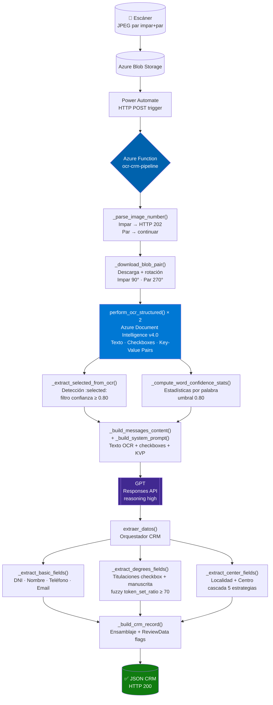
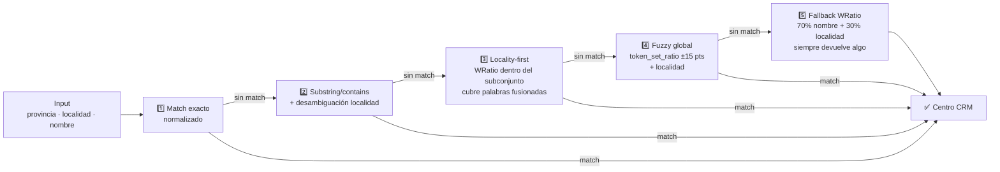
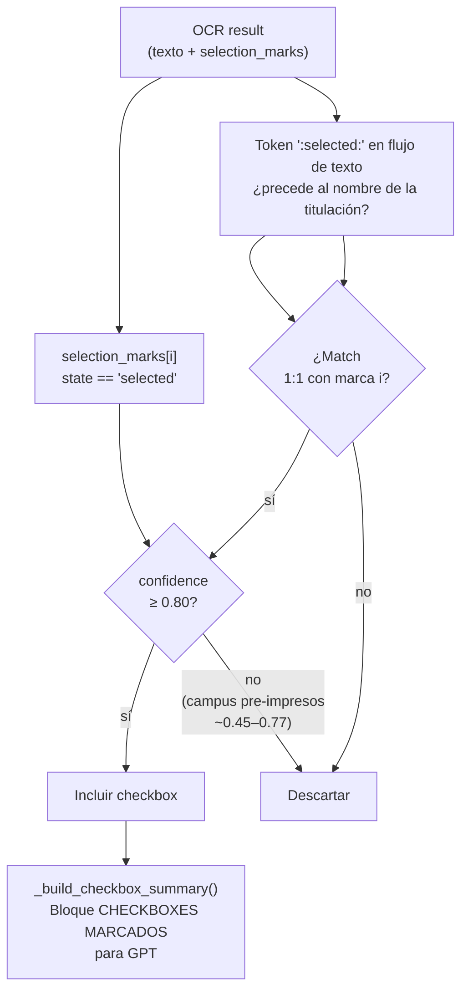

<div align="center">

# ocr-crm-pipeline

**Digitalización automatizada de fichas de inscripción académica manuscritas**

*Azure Function · OCR estructurado · Fuzzy matching · GPT*

[](https://www.python.org/)
[](https://azure.microsoft.com/services/functions/)
[](https://azure.microsoft.com/services/form-recognizer/)
[](https://openai.com/)
[](https://github.com/maxbachmann/RapidFuzz)
[](scripts/)

</div>

---

Azure Function que convierte fichas de inscripción **manuscritas y escaneadas** en registros CRM listos para importar. El escáner deposita los JPEG en Blob Storage, Power Automate dispara la función, y en segundos el operador tiene los datos estructurados del alumno: DNI, nombre, teléfono, email, titulaciones de interés y centro de procedencia.

> [!NOTE]
> Los catálogos de centros, titulaciones y localidades incluidos en este repositorio contienen **IDs ficticios** (anonimizados). En un despliegue real deben sustituirse por los IDs del CRM de la institución objetivo. Los archivos de catálogo en `centros/centrosTablasCRM/` y `localidades/` son regenerables con los scripts `procesar_centros_raw.py` y `fetch_localidades.py` apuntando a la API CRM correspondiente.

---

## Tabla de contenidos

- [Arquitectura del pipeline](#arquitectura-del-pipeline)
- [Quick start](#quick-start)
- [API Reference](#api-reference)
- [Campos del registro CRM](#campos-del-registro-crm)
- [Motor de matching](#motor-de-matching)
- [Detección de checkboxes](#detección-de-checkboxes)
- [Catálogos de datos](#catálogos-de-datos)
- [Tests](#tests)
- [Logs y debugging](#logs-y-debugging)
- [Estructura del proyecto](#estructura-del-proyecto)
- [Decisiones de diseño](#decisiones-de-diseño)
- [Limitaciones conocidas](#limitaciones-conocidas)

---

## Arquitectura del pipeline



---

## Quick start

### Prerrequisitos

- Python 3.11 (recomendado: conda env `fichas`)
- Cuenta Azure con Azure Functions, Blob Storage y Document Intelligence (Standard tier)
- Acceso a Azure OpenAI con despliegue GPT-4 o superior

### Variables de entorno

Crea `local.settings.json` en la raíz a partir de `local.settings.example.json`:

```json
{
  "IsEncrypted": false,
  "Values": {
    "AzureWebJobsStorage": "UseDevelopmentStorage=true",
    "FUNCTIONS_WORKER_RUNTIME": "python",
    "AZURE_STORAGE_CONNECTION_STRING": "DefaultEndpointsProtocol=...",
    "AZURE_BLOB_CONTAINER": "fichas-si-escaneadas",
    "DOCUMENT_INTELLIGENCE_ENDPOINT": "https://<resource>.cognitiveservices.azure.com/",
    "DOCUMENT_INTELLIGENCE_KEY": "<key>",
    "OPENAI_ENDPOINT": "https://<resource>.openai.azure.com/",
    "OPENAI_API_KEY": "<key>",
    "OPENAI_DEPLOYMENT_NAME": "gpt-4o",
    "OPENAI_API_VERSION": "2025-03-01-preview"
  }
}
```

### Instalación

```bash
pip install -r requirements.txt
```

### Ejecutar en local

```bash
func start
```

---

## API Reference

### `POST /api/procesa_ficha`

**Request**

```json
{
  "nombre_imagen": "scan_fichas_2025-11-28_22.jpeg",
  "prompt": "Extrae todos los datos del formulario"
}
```

> El número al final del nombre (`_22`) identifica el par. El sistema espera siempre los dos: impar (anverso) y par (reverso).

**Response `200` — éxito**

```json
[{
  "Description": "Solicitud de información procedente de escaneo automático",
  "DNI": "12345678A",
  "Firstname": "Juan",
  "Middlename": "García",
  "Lastname": "López Martínez",
  "Mobilephone": "+34612345678",
  "Email": "juan.garcia@gmail.com",
  "IdStudentCurse": "00000000-0000-0000-0000-000000000001",
  "ProvenanceCenterId": "00000000-0000-0000-0000-000000000002",
  "ProvenanceCenterName": "IES EJEMPLO - LOCALIDAD",
  "ProvenanceCenterProvinceId": "00000000-0000-0000-0000-000000000003",
  "ProvenanceCenterCityId": "00000000-0000-0000-0000-000000000004",
  "ProvenanceCenterCountryId": "00000000-0000-0000-0000-000000000005",
  "OtherCenter": "",
  "Degrees": [
    { "IdStudy": "00000000-0000-0000-0000-000000000006" },
    { "IdStudy": "00000000-0000-0000-0000-000000000007" }
  ],
  "ReviewData": false,
  "FieldsToReview": ""
}]
```

`IdStudy` y `Degrees` son campos alternativos y dinámicos. Si la ficha resuelve una sola
titulación, el registro usa `"IdStudy": "..."`; si resuelve dos o más titulaciones, usa
`"Degrees": [{"IdStudy": "..."}, ...]`.

**Códigos de respuesta**

| Código | Situación |
|--------|-----------|
| `200` | Éxito — array con el registro CRM procesado |
| `202` | Imagen impar recibida — esperando el reverso (par) |
| `400` | Error de validación — datos de entrada inválidos |
| `500` | Error interno durante el procesamiento |

---

## Campos del registro CRM

| Campo | Fuente | Función | Notas |
|-------|--------|---------|-------|
| `DNI` | GPT | `_normalize_dni_nie()` | Corrige OCR en posiciones numéricas; si la letra final alphabética no cuadra con módulo 23, se conserva y se marca revisión. Si falta letra o es dígito, se calcula y se marca revisión. |
| `Firstname` | GPT | `clean_text()` | Nombre limpiado |
| `Middlename` | GPT | split apellidos | Primera palabra de `apellidos` |
| `Lastname` | GPT | split apellidos | Resto de `apellidos` |
| `Mobilephone` | GPT | `_normalize_phone()` | Corrige letras OCR; añade `+34` si falta prefijo |
| `Email` | GPT | `_normalize_email()` | Elimina espacios internos; valida estructura para flags de revisión |
| `Description` | constante | `_build_crm_record()` | `"Solicitud de información procedente de escaneo automático"` |
| `IdStudentCurse` | GPT | `analyze_curso_local()` | `token_set_ratio` umbral 60 |
| `ProvenanceCenter*` | GPT | `analyze_center_optimized()` | Cascada de 5 estrategias |
| `OtherCenter` | GPT | literal | Solo si no hay match en catálogo CRM |
| `IdStudy` / `Degrees[].IdStudy` | Checkboxes + GPT | `map_checked_degrees()` | Campo dinámico: una titulación → `IdStudy`; varias → `Degrees[]` |
| `ReviewData` | — | `_build_crm_record()` | `true` si algún campo crítico tiene baja confianza OCR |
| `FieldsToReview` | — | `_build_crm_record()` | Lista de campos a revisar |

<details>
<summary>Reglas de propagación de <code>ReviewData</code></summary>

- **Nombre y Apellidos** se pueden propagar entre sí, salvo que el KVP del otro campo tenga confianza alta (≥90%).
- **Email** no hereda flags de Nombre/Apellidos. Se flaggea solo con evidencia propia: estructura inválida, acentos normalizados, palabra HIGH asociada al email, o dominio institucional/de centro (`school`, `colegio`, `instituto`, `academy`, `.org`, etc.).
- **Centro** no se flaggea solo por confianza OCR media si el CRM lo resolvió con match exacto/contains. Se flaggea si usa `OtherCenter`, o si estrategias fuzzy/locality/fallback caen por debajo de `CENTER_REVIEW_SCORE_THRESHOLD` (80).
- **DNI y Teléfono** se flaggean individualmente cuando la confianza de sus palabras cae bajo el umbral.

> Filosofía: el falso positivo (revisar algo que estaba bien) es preferible al falso negativo (dejar un dato erróneo en el CRM sin marcar).

</details>

---

## Motor de matching

### Resolución de provincia

`_find_province_key` aplica este pipeline en orden:

1. **Exacto** — cualquier clave cargada dinámicamente desde `centros/{PROVINCIA}.txt`
2. **Alias** — entradas explícitas + aliases de `localidades/provinceIds.json`
3. **Prefijo** (≥ 3 chars) — `VAL→VALENCIA`, `ALI→ALICANTE`, `MUR→MURCIA`, etc.
4. **Fuzzy** `max(ratio, WRatio)` umbral 60 — siempre devuelve algo

<details>
<summary>Tabla de aliases de provincia</summary>

| Provincia | Aliases cubiertos |
|-----------|-------------------|
| Valencia | `CV`, `C. Valenciana`, `Comunitat Valenciana`, `País Valenciano`, `Prov. de Valencia`, `Val3ncia` |
| Alicante | `Alacant`, `Alacante`, `Aliante`, `Elche`, `Elx`, `Alic4nte` |
| Castellón | `Castelló`, `Castello`, `Castillón`, `Castelion`, `Castellon de la Plana`, `Kostellon`, `Castel1on` |

</details>

### Normalización de localidad

`_normalize_localidad_input` aplica pares bilingüe explícitos y expansión de abreviaturas OCR antes del matching fuzzy (3 scorers: `ratio` + `token_set_ratio` + `WRatio`, umbral ≥ 80).

<details>
<summary>Aliases de localidad y abreviaturas OCR</summary>

**Pares bilingüe:**
`Játiva → XÀTIVA` · `Burriana → BORRIANA` · `Villarreal → VILA-REAL` · `Alcoy → ALCOI` · `Alcira → ALZIRA` · `Alacant → ALICANTE` · `Castellon → CASTELLÓN DE LA PLANA`

**Abreviaturas OCR frecuentes:**
`STA → SANTA` · `NTRA → NUESTRA` · `COL → COLEGIO` · `INST → INSTITUTO` · `CEIP → COLEGIO`

</details>

### Búsqueda de centro — cascada de 5 estrategias

`analyze_center_optimized` ejecuta las estrategias en orden y se detiene en el primer match:



**Cobertura de palabras fusionadas** (estrategia 3, `WRatio` + `partial_ratio`):

| Input OCR | Resultado |
|-----------|-----------|
| `Materdei` | `DIOCESANO MATER DEI` |
| `AusiàsMarch` | `AUSIÀS MARCH` |
| `AntonioMachado` | `ANTONIO MACHADO` |
| `BotanicCalduch` | `BOTÀNIC CALDUCH` |

---

## Detección de checkboxes

`_extract_selected_from_ocr` es la fuente única de detección. Combina dos señales de Azure Document Intelligence:



> El alumno puede marcar con `X` o tick. El patrón `:selected: X Titulación` elimina automáticamente el prefijo antes de extraer el nombre.

**Selección de variante provincial:**
Si una titulación existe en varias sedes, `_select_best_variant_by_province` prioriza la sede aplicable al centro del alumno y después aplica fallback.

| Provincia alumno | Variante aplicada |
|-----------------|-------------------|
| Alicante | Elche |
| Castellón | Castellón |
| Murcia | Elche |
| Otras provincias sin variante propia | Valencia |
| Valencia | Valencia |

---

## Catálogos de datos

| Catálogo | Archivo | Notas |
|----------|---------|-------|
| Titulaciones | `titulacion/titulaciones.txt` | ~100 titulaciones agrupadas por checkbox |
| Centros | `centros/{PROVINCIA}.txt` | 8 provincias activas |
| Cursos | `curso/cursos.txt` | 5 cursos (1º/2º Bach., 1º/2º CFGS, 4º ESO) |
| Localidades | `localidades/{PROVINCIA}.json` + `provinceIds.json` | localidades con IDs CRM por provincia |

> ⚠️ Los IDs en estos archivos son **ficticios** (anonimizados para este repositorio). Deben sustituirse por los IDs reales del CRM en cada despliegue.

<details>
<summary>Formato de los archivos de catálogo</summary>

**`titulacion/titulaciones.txt`**
```
NOMBRE TITULACIÓN, IdTitulacion
NOMBRE TITULACIÓN (CASTELLÓN), IdTitulacion
NOMBRE TITULACIÓN (ELCHE), IdTitulacion

[línea en blanco = separador de checkbox]
```

**`centros/PROVINCIA.txt`**
```
NOMBRE CENTRO (LOCALIDAD), Id, IdProvince, IdCity, IdCountry
```

**`localidades/PROVINCIA.json`**
```json
[{ "Id": "...", "Name": "CASTELLÓN DE LA PLANA", "Name_cat": "CASTELLÓ DE LA PLANA" }]
```

Para regenerar desde el CRM:
```bash
python scripts/fetch_localidades.py       # Requiere credenciales API CRM
python -m scripts.procesar_centros_raw    # Procesa centros/centrosTablasCRM/*.xlsx
```

</details>

---

## Tests

El proyecto tiene tests locales organizados en scripts, sin pytest.

```bash
export PYTHONPATH="/ruta/al/repo"

# Suite de centros — principal
python -m scripts.test_centros

# Suite DNI/teléfono — 45 tests
python -m scripts.test_dni_phone

# Flags de revisión
python -m scripts.test_review_flags

# Normalización DNI/NIE
python -m scripts.test_dni_normalize

# Matching de cursos
python -m scripts.test_course_matching

# Errores ortográficos OCR
python -m scripts.test_misspell_cases

# Confianza de palabras OCR
python -m scripts.test_word_confidence
```

<details>
<summary>Cómo añadir un test nuevo</summary>

**Patrón `test_centros.py`**
```python
r = analyze_center_optimized("Valencia", "Godella", "EDELWEISS")
got = r.get("Name", "") if r else ""
passed = "EDELWEISS" in got.upper()
results.append(("nombre 'EDELWEISS' Godella", passed))
print(f"  {'OK' if passed else 'FAIL'}: {got or '(vacío)'}")
```

**Patrón `test_dni_phone.py`**
```python
check(results, "OCR: O→0 en posición 3",
      _normalize_dni_nie("123O5678A"), "12305678A")
```

Para añadir una suite completa: crea `run_nueva_suite_tests() -> bool`, añádela al bloque `if __name__ == "__main__"` e inclúyela en `overall = ok1 and ok2 and ... and ok_nueva`.

</details>

---

## Logs y debugging

Cada módulo emite logs con etiquetas estructuradas para facilitar el filtrado en producción.

| Etiqueta | Qué traza |
|----------|-----------|
| `[DI_EXTRACT_SUMMARY img=N]` | Resumen por imagen: texto, confianza, marcas aceptadas/rechazadas, KVP |
| `[OCR_STRUCTURED]` | Resultado OCR completo, selection marks, estadísticas |
| `[CHECKBOX_SUMMARY]` | Lista de checkboxes marcados enviada a GPT |
| `[CENTER_SEARCH]` | Estrategia usada, candidatos y score en cada paso |
| `[CENTER_MATCH]` | Centro seleccionado y puntuación final |
| `[GPT_ANALYZE]` | Pipeline GPT completo: input, output, campos extraídos, timing |
| `[TITULACION_MATCH]` | Matches de titulaciones con scores |
| `[LOCALIDAD_NORM]` | Normalización: input → output con score |
| `[PROVINCE]` | Resolución de provincia: alias, prefijo o fuzzy |
| `[DNI_NORMALIZE]` / `[PHONE_NORMALIZE]` | Correcciones OCR por campo |
| `[WORD_CONFIDENCE]` | Estadísticas de confianza por palabra |
| `[EXTRAER_DATOS]` | Resumen completo de la transformación CRM |

> [!TIP]
> Para auditar un caso problemático: filtra primero por `[CENTER_SEARCH]` y `[CENTER_MATCH]` para centros, o por `[TITULACION_MATCH]` para titulaciones. Los logs muestran todos los candidatos con sus scores antes de la selección final.

---

## Estructura del proyecto

```
ocr-crm-pipeline/
├── procesa_ficha/
│   ├── __init__.py          # Toda la lógica (~3 000 líneas, 13 secciones)
│   └── function.json        # HTTP trigger binding
│
├── centros/                 # Catálogos de centros por provincia (IDs anonimizados)
│   ├── VALENCIA.txt
│   ├── ALICANTE.txt
│   ├── CASTELLON.txt
│   ├── ALBACETE.txt
│   ├── BALEARES.txt
│   ├── CUENCA.txt
│   ├── MURCIA.txt
│   ├── TERUEL.txt
│   └── centrosPendientesMatching.txt
│
├── titulacion/
│   └── titulaciones.txt     # ~100 titulaciones (IDs anonimizados)
│
├── curso/
│   └── cursos.txt           # 5 cursos (IDs anonimizados)
│
├── localidades/
│   ├── VALENCIA.json
│   ├── ALICANTE.json
│   ├── CASTELLON.json
│   ├── ALBACETE.json
│   ├── BALEARES.json
│   ├── CUENCA.json
│   ├── MURCIA.json
│   ├── TERUEL.json
│   └── provinceIds.json
│
├── scripts/
│   ├── test_centros.py
│   ├── test_dni_phone.py
│   ├── test_review_flags.py
│   ├── test_dni_normalize.py
│   ├── test_course_matching.py
│   ├── test_misspell_cases.py
│   ├── test_word_confidence.py
│   ├── fetch_localidades.py
│   └── procesar_centros_raw.py
│
├── docs/
│   └── tecnico/
│       ├── DOCUMENTACION_TECNICA.md
│       └── EXTRACTION_FLOW.md
│
├── host.json                # Config Azure Functions v4
├── requirements.txt
└── local.settings.json      # Variables de entorno — NO subir a git (ver .example)
```

---

## Decisiones de diseño

<details>
<summary>Por qué GPT no recibe las imágenes directamente</summary>

GPT solo recibe texto OCR + resumen de checkboxes. Azure Document Intelligence ya extrae el texto con alta precisión y sus coordenadas son más fiables que la visión directa del modelo. Esto reduce coste y latencia sin pérdida significativa de precisión.

</details>

<details>
<summary>Por qué el fallback de centros siempre devuelve algo</summary>

Un match incorrecto que el operador CRM puede corregir es mejor que un campo vacío que nadie puede recuperar. El flag `ReviewData` avisa cuando la confianza es baja.

</details>

<details>
<summary>Por qué sin JSON Schema estricto en GPT</summary>

Se usa `json_object` en vez de JSON Schema. Evita rechazos por campos opcionales vacíos, que en fichas manuscritas son frecuentes (el alumno no siempre rellena todos los campos).

</details>

<details>
<summary>Umbrales de matching y confianza OCR</summary>

| Parámetro | Valor | Uso |
|-----------|-------|-----|
| `TITULACION_MATCH_THRESHOLD` | 70 | fuzzy titulaciones |
| `PROVINCE_MATCH_THRESHOLD` | 60 | fuzzy provincia |
| `COURSE_MATCH_THRESHOLD` | 60 | fuzzy curso |
| `SELECTION_MARK_CONFIDENCE_THRESHOLD` | 0.80 | filtrado checkboxes (campus pre-impresos ~0.45–0.77) |
| `WORD_CONFIDENCE_THRESHOLD` | 0.80 | palabras OCR enviadas como incertidumbre |
| `WORD_CONFIDENCE_HIGH_CUTOFF` | 0.40 | tier HIGH para evidencia OCR fuerte |
| `CENTER_REVIEW_SCORE_THRESHOLD` | 80 | score mínimo para no revisar centros fuzzy/locality/fallback |
| `GPT_MAX_OUTPUT_TOKENS` | 32 000 | límite respuesta GPT |
| Localidad scoring | ≥ 80 | `ratio` + `token_set` + `WRatio` |

> Bajar umbrales aumenta falsos positivos. Revisar telemetría en producción antes de modificarlos.

</details>

---

## Limitaciones conocidas

- **Solo 2 caras** — el sistema asume exactamente anverso + reverso. No soporta 1 o 3+ páginas.
- **Cobertura de centros acotada** — solo hay matching automático para las provincias con TXT en `centros/` y JSON en `localidades/`. Si llega una provincia no catalogada, el match de centro puede ser incorrecto.
- **Catálogos estáticos** — si cambian titulaciones, centros o localidades en el CRM, regenerar archivos y redesplegar.
- **Sin cola de reintentos** — no hay recuperación automática ante fallos de OCR o GPT.
- **Rotación fija** — asume orientación constante en la bandeja del escáner. Si cambia, ajustar `_download_blob_pair`.
- **Fallback sin umbral mínimo en centros** — siempre devuelve el mejor candidato aunque el score sea bajo; usar `ReviewData` para detectarlo.

---

<div align="center">

*Documentación verificada contra el código fuente (`procesa_ficha/__init__.py`).*

</div>
